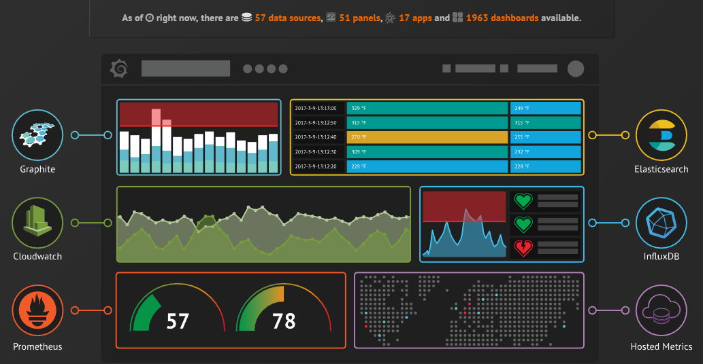

# Monitoring of RTI Connext DDS with Prometheus
###### Overview and demonstration

---
# RTI Connext DDS
* Short description
* Partitioning (Domain, Topic, ...)

---
# Monitoring Library
* What is it?
* Topics involved

---
# Monitoring of Routing Service
* What is it?
* Topics involved?

---
#  Prometheus

> Prometheus, a Cloud Native Computing Foundation project, is a systems and service monitoring system. It collects metrics from configured targets at given intervals, evaluates rule expressions, displays the results, and can trigger alerts if some condition is observed to be true.

---
#  Prometheus - Architecture

---
#  Grafana

> Grafana is an open source, feature rich metrics dashboard and graph editor for Graphite, Elasticsearch, OpenTSDB, Prometheus and InfluxDB.

---
#  Grafana

---
# Collectors
* Principle

---
# Example deployment
* Kubernetes
* Prometheus
* RTI Shapes Demo

---
# Demo
* Showcases
  * Core and Routing Dashboards
  * Topic sizes?
  * Change something

---
# ✅ Advantages
* First
* Second

---
# ⛔️ Disadvantages
* First
* Second

---
# 🤔 Open Points
* First
* Second

---
# 🙏 Thank you for your attention!

### Links
http://www.github.com/aguther/presentations
http://www.github.com/aguther/deployment-kubernetes
http://www.github.com/aguther/deployment-containers-rti
