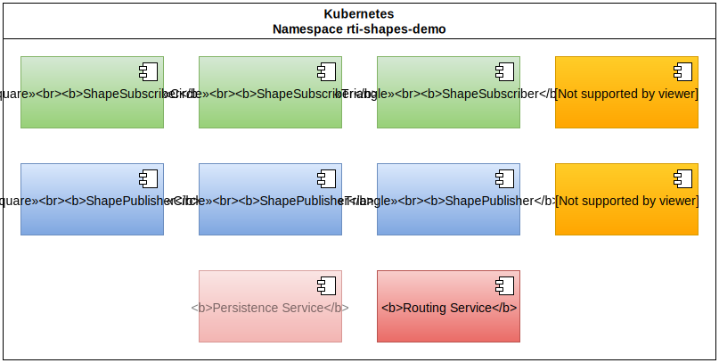
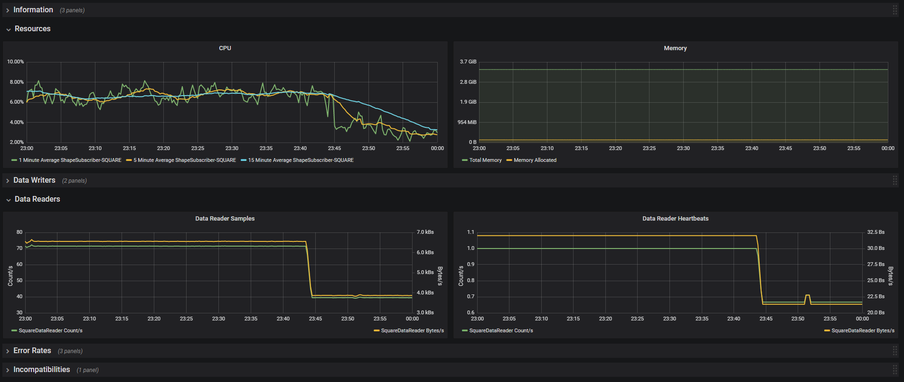

# Monitoring of RTI Connext DDS with Prometheus

## Overview and demonstration

---

# Data Distribution Service

> The Data Distribution Service (DDS) for real-time systems is an Object Management Group (OMG) machine-to-machine (sometimes called middleware or connectivity framework) standard that aims to enable dependable, high-performance, interoperable, real-time, scalable data exchanges using a publish–subscribe pattern.

---

# Data Distribution Service - Overview


---

# Data Distribution Service - Layered Data Bus


---

# RTI Connext DDS

> RTI Connext DDS implements the Data-Centric Publish-Subscribe (DCPS) API within the OMG’s Data Distribution Service (DDS) for Real-Time Systems. DDS is the first standard developed for the needs of real-time systems. DCPS provides an efficient way to transfer data in a distributed system.

---

# RTI Connext DDS


---

# Monitoring Library

* Can be dynamically loaded and attached to RTI Connext DDS libraries
* Reads data from the core libraries and writes them to defined topics
* Several configuration parameters available, e.g. how often data is written
* RTI Monitor can read and show the monitoring data

---

# Monitoring Library


---

# Monitoring of Routing Service

* If enabled, Routing Service writes monitoring data to defined topics
* Several configuration parameters available, e.g. how often data is written
* RTI Admin Console can read and show the monitoring data

---

# Monitoring of Routing Service


---

# Monitoring of Routing Service


---

#  Prometheus

> Prometheus, a Cloud Native Computing Foundation project, is a systems and service monitoring system. It collects metrics from configured targets at given intervals, evaluates rule expressions, displays the results, and can trigger alerts if some condition is observed to be true.

#  Grafana

> Grafana is an open source, feature rich metrics dashboard and graph editor for Graphite, Elasticsearch, OpenTSDB, Prometheus and InfluxDB.

---

# Architecture


---

# Collector - Data Flow


* Collector subscribes to DDS topics to receive the monitoring data
* Collector converts monitoring data into prometheus metrics (with labels)
* Prometheus is scraping the collector regularly to read metrics

---

# Collector - Metric example

```
# HELP dds_routing_service_process_uptime_seconds Time in seconds elapsed since the running service process started.
# TYPE dds_routing_service_process_uptime_seconds gauge
dds_routing_service_process_uptime_seconds{routing_service="default",} 301.0
```

---

# RTI Shapes Demo


* Usage to improve understanding
* Usage for compatibility tests
* Repository dds-examples provides the following console applications:
  * ShapePublisher
  * ShapeSubscriber

---

# Deployment - Namespace



---

# Deployment - Connection of HMI


---

# Deployment - Scraping


---

# Demo

---

# Demo - Screenshot Overview


---

# Demo - Screenshot Application



---

# Demo - Screenshot Routing Service


---

# Conclusions

* ✅ ... the good
  * good metrics available
  * separation of monitoring and alerting from business logic
  * multiple ways to notify for alerting
* ⛔ ... the bad
  * additional DDS traffic is generated
  * some metrics are still confusing (e.g. remote entities)
* 🤔 ... the pondering
  * revisit of labels to be used (new set of labels create a new series)
  * usage of collector as side-car to have a more clear mapping to pods

---

# 🙏 Thank you for your attention!

---

# Links

###### Presentation

https://www.github.com/aguther/presentations

###### Data Distribution Service

https://www.dds-foundation.org
https://community.rti.com/documentation

###### Code

https://www.github.com/aguther/dds-examples
https://www.github.com/aguther/deployment-kubernetes
https://www.github.com/aguther/deployment-containers-rti
